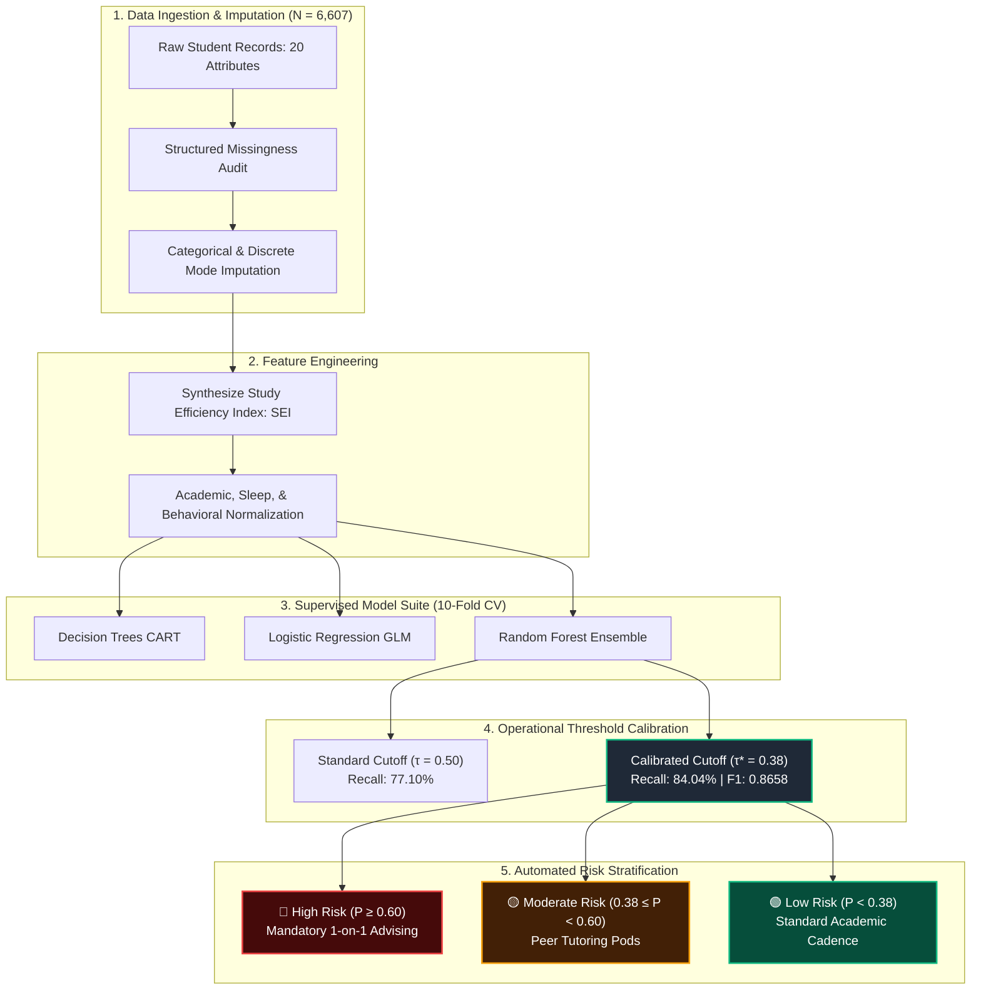

<div align="center">

```text
  █████╗ ███████╗██████╗ ██╗██████╗ ███████╗
 ██╔══██╗██╔════╝██╔══██╗██║██╔══██╗██╔════╝
 ███████║███████╗██████╔╝██║██████╔╝█████╗  
 ██╔══██║╚════██║██╔═══╝ ██║██╔══██╗██╔══╝  
 ██║  ██║███████║██║     ██║██║  ██║███████╗
 ╚═╝  ╚═╝╚══════╝╚═╝     ╚═╝╚═╝  ╚═╝╚══════╝
 ───────────────────────────────────────────
   Academic Success Prediction through 
        Intelligent Risk Evaluation         
 ───────────────────────────────────────────

             ______ ______
           _/      Y      \_
          // ~~ ~~ | ~~ ~  \\
         // ~ ~ ~~ | ~~~~ ~~ \\
        //________.|.________\\
       `----------`-'----------'
</div>

<p align="center">
  <b>An end-to-end predictive machine learning framework developed in R to shift institutional advising from post-exam grading to proactive, early-term intervention.</b>
</p>

[](#)
[](#)
[](#)
[-84.04%25-brightgreen?style=for-the-badge)](#)
[](#)
[](#)

[System Overview](#-system-overview) •
[Architecture & Pipeline](#-architecture--pipeline) •
[Feature Synthesis](#-feature-synthesis-study-efficiency-index-sei) •
[Empirical Results](#-empirical-evaluation--benchmarks) •
[Feature Importance](#-behavioral-impact--gini-importance) •
[Advising Protocols](#-risk-stratification--intervention-matrix) •
[Quickstart](#-quickstart--usage)

---

</div>

## 📌 System Overview

Most academic early-warning systems suffer from a **latency flaw**: triage triggers *after* midterms or assignment deadlines have passed, leaving minimal runway for recovery.

**Project ASPIRE** systematically shifts risk evaluation upstream into the first weeks of the academic term:
- **Cohort Scale:** Validated across a benchmark dataset of **6,607 student records** spanning **20 multidimensional dimensions**.
- **Target Condition:** Early isolation of students scoring in the lower quartile ($\text{Exam Score} \le 65$).
- **Optimized Detection:** Decision threshold recalibrated from the standard $0.50$ default to **$\tau^* = 0.38$**, capturing **84.04% of at-risk students** ($F_1 = 0.8658$) with an overall **ROC-AUC of 0.976**.
- **Actionable Insight:** Over **66% of outcome variance** is driven by dynamic behavioral routines (attendance consistency, study efficiency) rather than fixed demographic background.

---

## 🏗️ Architecture & Pipeline

```text
+-------------------------------------------------------------------------------+
|                        PROJECT ASPIRE END-TO-END PIPELINE                     |
+-------------------------------------------------------------------------------+
                                        |
  [01 INGESTION]                        v
  +-----------------------------------------------------------------------------+
  |  Benchmark Dataset: 6,607 Student Records across 20 Multidimensional Vars   |
  |  - Academic History  - Study Habit Pacing  - Sleep Regularity  - Attendance |
  +-----------------------------------------------------------------------------+
                                        |
  [02 IMPUTATION]                       v
  +-----------------------------------------------------------------------------+
  |  Structured Missingness Resolution                                          |
  |  - Categorical & Discrete Features: Localized Mode Imputation               |
  |  - Continuous Scaling & Normalization Matrices                              |
  +-----------------------------------------------------------------------------+
                                        |
  [03 FEATURE SYNTHESIS]                v
  +-----------------------------------------------------------------------------+
  |  Domain Interaction Engine: Study Efficiency Index (SEI)                     |
  |  SEI = (Weekly Study Hours * Milestone Assessment) / (Sleep Variance + eps) |
  +-----------------------------------------------------------------------------+
                                        |
  [04 MODEL TRAINING & CV]              v
  +-----------------------------------------------------------------------------+
  |  Stratified 10-Fold Cross-Validation Suite                                  |
  |  [ CART Trees ]  <--->  [ Logistic Regression ]  <--->  [ Random Forest ]   |
  +-----------------------------------------------------------------------------+
                                        |
  [05 THRESHOLD CALIBRATION]            v
  +-----------------------------------------------------------------------------+
  |  Optimization on At-Risk Cohort (Score <= 65)                               |
  |  Shift Default (tau = 0.50)  -->  Operational Target (tau* = 0.38)          |
  |  Recall: 77.10% -> 84.04%   | ROC-AUC: 0.976 | F1: 0.8658                  |
  +-----------------------------------------------------------------------------+
                                        |
  [06 ADVISING TRIAGE]                  v
  +-----------------------------------------------------------------------------+
  |  Automated Departmental Roster Dispatch                                     |
  |  - High Risk (P >= 0.60)       --> Mandatory 1-on-1 Counseling + Study Hall |
  |  - Moderate Risk (0.38 <= P < 0.60) --> Peer-Assisted Learning Pods         |
  |  - Low Risk (P < 0.38)         --> Standard Advisory Cadence                |
  +-----------------------------------------------------------------------------+
```



---

## 🔬 Feature Synthesis: Study Efficiency Index (SEI)

Raw study volume often fails to correlate linearly with performance when sleep schedules are disrupted. ASPIRE models cross-domain friction via the **Study Efficiency Index (SEI)**:

$$\text{SEI} = \frac{\text{Weekly Study Hours} \times \text{Continuous Assessment Performance}}{\sigma_{\text{sleep}} + \epsilon}$$

Where:
- $\sigma_{\text{sleep}}$ measures circadian variance and rolling sleep irregularity.
- $\epsilon = 10^{-4}$ provides numerical stability for strict baseline routines.

---

## 📊 Empirical Evaluation & Benchmarks

Models were trained and evaluated via stratified **10-fold cross-validation** specifically targeting the at-risk condition ($\text{Exam Score} \le 65$).

| Model Architecture | Accuracy | ROC-AUC | Recall (At-Risk) | Precision | $F_1$-Score |
|:---|:---:|:---:|:---:|:---:|:---:|
| Decision Tree (CART) | 88.10% | 0.891 | 72.30% | 0.7812 | 0.7510 |
| Logistic Regression | 90.40% | 0.923 | 76.85% | 0.8240 | 0.7953 |
| Random Forest ($\tau = 0.50$) | **94.80%** | **0.976** | 77.10% | **0.9120** | 0.8356 |
| ⚡ **Random Forest ($\tau^* = 0.38$)** | 93.60% | **0.976** | **84.04%** | 0.8930 | **0.8658** |

### Decision Boundary Tuning ($\tau^* = 0.38$)

In educational early-warning systems, **False Negatives are unrecoverable** (an at-risk student drops out or fails unassisted), whereas **False Positives only mean extra academic tutoring**. Calibrating to $\tau^* = 0.38$ maximizes sensitivity while retaining a 0.8930 precision profile.

```text
At-Risk Detection Sensitivity by Decision Cutoff (tau)
========================================================================================
Cutoff (tau)    Recall   ASCII Visual Representation                            Status
----------------------------------------------------------------------------------------
tau = 0.50      77.10%   |==============================......|                  Baseline
tau = 0.44      80.20%   |================================....|                  Shift
tau* = 0.38     84.04%   |==================================..|  <- OPTIMAL   (ASPIRE)
tau = 0.30      89.15%   |====================================|                  High FP
========================================================================================
```

---

## 🎯 Behavioral Impact & Gini Importance

Decomposition via Mean Decrease in Gini Impurity proves that modifiable student habits drive the majority of academic variance:

```text
========================================================================================
FEATURE DIMENSION                 GINI %    DISTRIBUTION (ACTIONABLE VS STATIC)
========================================================================================
Class Attendance Rate             36.2%     [####################################]
Study Efficiency Index (SEI)      29.9%     [##############################]
Prior Assessment Milestones       14.1%     [##############]
Sleep Routine Consistency          9.3%     [#########]
Socio-Demographic Indicators       6.8%     [######]  <- Static Background
Other Environmental Factors        3.7%     [###]
========================================================================================
[Actionable Behavioral Dimensions: 66.1%]              [Static Demographics: 6.8%]
```

> **Advising Takeaway:** Student trajectory is overwhelmingly determined by attendance consistency and effective study rhythms. Interventions should prioritize operational habit-building over deficit-based assumptions.

---

## 🚦 Risk Stratification & Intervention Matrix

ASPIRE automatically routes students into risk tiers based on individual probability scores:

| Tier | Probability Range | Risk Classification | Operational Intervention Protocol |
|:---:|:---:|:---:|:---|
| 🔴 **Tier 1** | $P(\text{Risk}) \ge 0.60$ | **High Risk** | Immediate advisor assignment within 48h; mandatory 1-on-1 consultation; dedicated study hall placement; weekly diagnostic check-ins. |
| 🟡 **Tier 2** | $0.38 \le P < 0.60$ | **Moderate Risk** | Enrollment into peer-assisted learning pods; automated bi-weekly attendance check pings; academic time-management modules. |
| 🟢 **Tier 3** | $P(\text{Risk}) < 0.38$ | **Low Risk** | Standard curriculum monitoring; access to self-service study resources. |

---

## 📂 Repository Structure

```bash
project-aspire/
├── data/
│   ├── raw/                      # Educational benchmark cohort (6,607 records)
│   └── processed/                # Cleaned, imputed, and scaled matrices
├── R/
│   ├── 01_data_preprocessing.R   # Mode imputation and missingness checks
│   ├── 02_feature_engineering.R  # SEI synthesis and interaction logic
│   ├── 03_model_training.R       # CART, Logistic Regression, Random Forest
│   ├── 04_threshold_tuning.R     # Cutoff derivation and ROC optimization
│   └── 05_alert_dispatch.R       # Automated student triage generator
├── models/
│   └── random_forest_final.rds   # Serialized production model object
├── reports/
│   ├── figures/                  # ROC plots, calibration curves, Gini ranks
│   └── student_risk_alerts.csv   # Target early-warning advisory roster
├── config.yml                    # Pipeline parameters and threshold configs
├── run_pipeline.R                # Master orchestration script
└── README.md
```

---

## 🚀 Quickstart & Usage

### 1. Requirements

- **R version $\ge$ 4.2.0**
- Install dependent packages:

```R
install.packages(c(
  "tidyverse",
  "caret",
  "randomForest",
  "pROC",
  "ROCR",
  "yaml"
))
```

### 2. Execution

```bash
# Clone repository
git clone https://github.com/your-institution/project-aspire.git
cd project-aspire

# Run the complete preprocessing, training, and evaluation pipeline
Rscript run_pipeline.R
```

### 3. Generated Advisory Output

The pipeline outputs an actionable CSV roster at `reports/student_risk_alerts.csv`:

```text
+-----------+-----------------+-----------+-----------------+--------------------------------+
| StudentID | RiskProbability | RiskTier  | PrimaryDriver   | RecommendedIntervention        |
+-----------+-----------------+-----------+-----------------+--------------------------------+
| ST-0194   | 0.784           | High      | Attendance      | 1-on-1 Counseling + Study Hall |
| ST-1048   | 0.492           | Moderate  | Low SEI         | Peer Tutoring (Math/Sci Pod)   |
| ST-3302   | 0.118           | Low       | None            | Standard Curriculum            |
+-----------+-----------------+-----------+-----------------+--------------------------------+
```

---

## 📄 License

Distributed under the MIT License. See [LICENSE](LICENSE) for full details.
